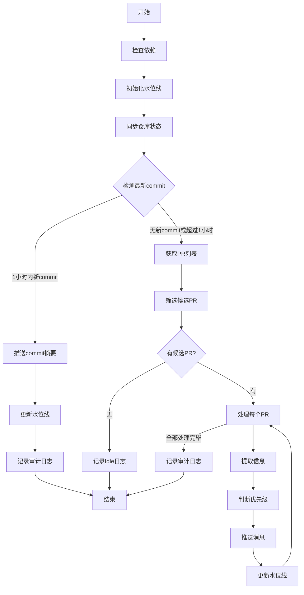

```
# CLAUDE.md

This file provides guidance to Claude Code (claude.ai/code) when working with code in this repository.
```

## 项目概述

这是一个 **保研信息自动跟踪系统**，用于定时监控 GitHub 仓库 `CS-BAOYAN/CSLabInfo2025` 的更新，筛选出与计算机、生物医学工程、电子信息专业相关的保研招生和实习信息，并通过消息推送机制发送给用户。

## 代码架构与核心组件

### 1. 系统架构

```
┌──────────────────┐     ┌──────────────────┐     ┌──────────────────┐
│ tracker_config.sh│     │ tracker_extract.sh│     │ tracker_main.sh  │
└──────────────────┘     └──────────────────┘     └──────────────────┘
          │                       │                       │
          ├───────────────────────┼───────────────────────┤
          │                       │                       │
          ▼                       ▼                       ▼
┌──────────────────────────────────────────────────────────────┐
│                      保研信息跟踪工作流                        │
└──────────────────────────────────────────────────────────────┘
          │                       │                       │
          ▼                       ▼                       ▼
┌──────────────────┐     ┌──────────────────┐     ┌──────────────────┐
│   配置管理模块    │     │   信息提取模块    │     │   主流程控制模块  │
└──────────────────┘     └──────────────────┘     └──────────────────┘
```

### 2. 核心文件说明

| 文件名 | 功能 | 主要内容 |
|-------|------|----------|
| `tracker_config.sh` | 配置管理 | 路径配置、时间窗口设置、目标仓库、PR拉取上限 |
| `tracker_extract.sh` | 信息提取 | 老师姓名、邮箱、优先级判断的字段提取函数 |
| `tracker_main.sh` | 主流程控制 | 水位线初始化、仓库同步、commit早退、PR增量筛选、日志写入 |

### 3. 执行流程



## 关键功能与设计理念

### 1. 时间窗口机制

- **Commit早退窗口**：1小时（3600秒）- 若最新commit在1小时内，直接推送摘要并结束流程
- **PR静默窗口**：1小时（3600秒）- PR更新后1小时内不推送，避免重复推送
- **水位线机制**：记录上次扫描时间，实现增量扫描

### 2. 优先级判定

- **高优先级**：涉及前沿交叉学科或主流AI方向
  - 关键词：多模态、LLM/Agent、具身智能、AI4Science、计算医学、医疗影像、大模型安全、系统安全
- **常规**：标准招生流程信息
  - 关键词：夏令营、预推免、推免宣讲、直博生招收、导师意向征集、招生说明会

### 3. 部署与配置

#### 环境变量覆盖

```bash
# 运行时覆盖配置
REPO_DIR=/path/to/repo TRACKER_DIR=/path/to/tracker bash ./tracker_main.sh
```

#### 默认部署路径

- 脚本存放：`./baoyan-tracker/scripts/`
- 数据存储：`./baoyan-tracker/data/tracker/`

## 运行与维护

### 执行命令

```bash
bash ./tracker_main.sh
```

### 依赖检查

脚本会自动检查以下依赖：
- `git` - 版本控制
- `gh` - GitHub CLI
- `jq` - JSON处理
- `date` - 日期时间工具

### 审计日志

每轮执行后会写入审计日志（`llog`），记录：
- 扫描PR数
- 候选PR数
- 命中高优先级数量
- 命中常规数量
- 过滤干扰项数量
- 错误数

### 输出示例

#### Commit早退路径

```
Found new commit on main branch.
<commit信息>
<改动文件列表>
<新增内容>
```

#### PR处理路径

```
Result: PR#123 | Level: 高优先级 | Name: 张教授 | Contact: zhang@university.edu.cn
```

## 开发与扩展

### 字段提取函数扩展

在 `tracker_extract.sh` 中添加新的提取函数：

```bash
extract_field() {
    local diff_raw="$1"
    echo "$diff_raw" | grep -oP "your-pattern"
}
```

### 优先级判定规则扩展

在 `tracker_extract.sh` 中修改 `detect_priority_level()` 函数：

```bash
detect_priority_level() {
    local diff_raw="$1"
    if echo "$diff_raw" | grep -Eiq "new-keyword-1|new-keyword-2"; then
        echo "高优先级"
    elif echo "$diff_raw" | grep -Eiq "other-keyword"; then
        echo "常规"
    else
        echo "低优先级"
    fi
}
```

### 推送接口扩展

在 `tracker_main.sh` 中修改 `send_message()` 函数：

```bash
send_message() {
    local msg="$1"
    if [ -n "${MESSAGE_SINK_CMD:-}" ]; then
        # 自定义推送命令
        printf "%s\n" "$msg" | bash -lc "$MESSAGE_SINK_CMD"
    else
        # 默认输出到控制台
        echo "[PUSH]"
        printf "%s\n" "$msg"
    fi
}
```
